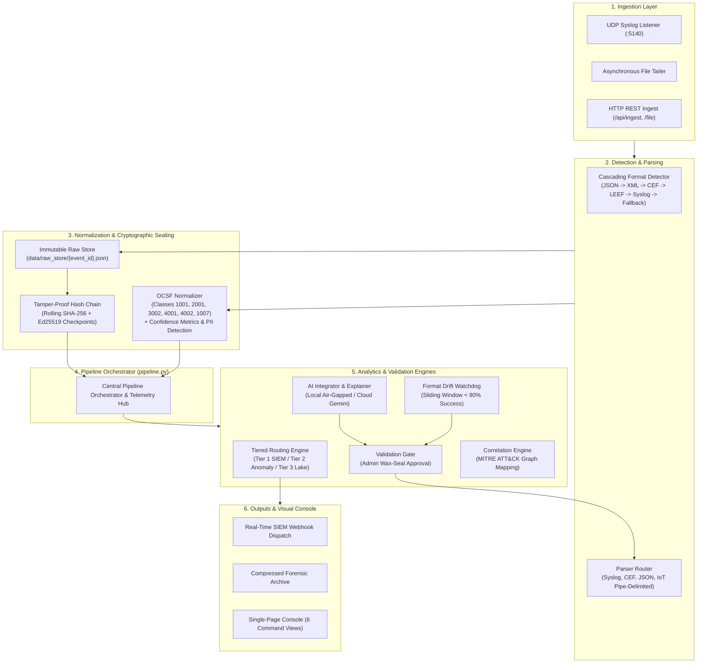

# LogSetu (लॉगसेतु)

[](LICENSE)
[](https://www.sih.gov.in/)
[](https://ntro.gov.in/)
[](#)
[](https://www.python.org/)
[](https://fastapi.tiangolo.com/)
[](https://schema.ocsf.io/)
[](#)

> **Universal Log Pre-processing & Cryptographic Forensic Pipeline for Heterogeneous Sovereign Telemetry**  
> *Built for Problem Statement SIH26156 -- National Technical Research Organisation (NTRO)*

---

## Table of Contents

- [The Problem](#the-problem)
- [The Solution -- LogSetu](#the-solution----logsetu)
- [Key Capabilities](#key-capabilities)
- [Architecture & Pipeline](#architecture--pipeline)
- [Tech Stack](#tech-stack)
- [Feature Implementation Status](#feature-implementation-status)
- [Interface & Screenshots](#interface--screenshots)
- [Getting Started & Quickstart](#getting-started--quickstart)
  - [Prerequisites](#prerequisites)
  - [Local Installation (Standard)](#local-installation-standard)
  - [Docker Compose Deployment](#docker-compose-deployment)
- [Project Structure](#project-structure)
- [API Reference Overview](#api-reference-overview)
- [Team & Problem Statement Info](#team--problem-statement-info)
- [License](#license)
- [Acknowledgments](#acknowledgments)

---

## The Problem

Modern Security Operations Centers (SOCs) and critical national defense infrastructure ingest massive volumes of telemetry from hundreds of heterogeneous sources: enterprise firewalls, Linux servers, Windows Domain Controllers, cloud platforms (AWS, Azure), Kubernetes clusters, EDR agents, and proprietary IoT devices.

These log streams present four critical operational bottlenecks:

1. **Format Fragmentation & Parser Delays:** Logs arrive in dozens of incompatible schemas—RFC 5424/3164 Syslog, ArcSight CEF, IBM LEEF, raw JSON, XML, and undocumented pipe-delimited feeds. Manually engineering regular expression parsers takes 1–2 weeks per format, creating severe telemetry ingestion delays.
2. **Silent Parser Breakage (Format Drift):** When upstream network appliances update firmware or alter field formatting, traditional parsers fail silently, dropping critical security fields without operator awareness.
3. **Prohibitive SIEM Licensing Overhead:** Commercial SIEM solutions (Splunk, Microsoft Sentinel) charge licensing fees indexed directly to raw ingested volume. Organizations frequently spend $200K–$2M+/year ingesting logs, of which **40% to 70%** is low-value, repetitive background noise (e.g., routine iptables denies, debug pings).
4. **Forensic Vulnerability & Sovereign Constraints:** Traditional log collectors write mutable records to flat files on disk where attackers or insiders can alter historical audit trails without cryptographic detection. Furthermore, sovereign defense agencies (such as NTRO) cannot route sensitive network telemetry through foreign, cloud-only SaaS platforms due to air-gapped infrastructure mandates.

---

## The Solution — LogSetu

**LogSetu** is an on-premises, air-gapped **Security Data Pipeline Platform (SDPP)** that intercepts heterogeneous raw telemetry at high throughput, parses and normalizes it into the vendor-neutral **Open Cybersecurity Schema Framework (OCSF)**, cryptographically seals forensic auditability via an **Ed25519-signed SHA-256 rolling hash chain**, deflects **40% to 70%** of low-signal volume through **tiered routing**, monitors **format drift**, and provides **AI-assisted schema onboarding with an explicit human-in-the-loop validation gate**.

### The Meaning of "LogSetu"
> **Setu (सेतु)** is Sanskrit and Hindi for **Bridge**.  
> LogSetu serves as an autonomous, sovereign bridge connecting fragmented, vendor-locked log feeds to unified, tamper-evident security defense.

---

## Key Capabilities

| Capability | Technical Mechanism | Operational Benefit |
| :--- | :--- | :--- |
| **Universal Parsing** | Sub-millisecond cascading detection (`JSON` $\to$ `XML` $\to$ `CEF` $\to$ `LEEF` $\to$ `Syslog` $\to$ `Fallback`) | Ingests any structured or semi-structured log stream without upfront configuration. |
| **OCSF Normalization** | Strict transformation into OCSF event classes (1001, 2001, 3002, 4001, 4002, 1007) with per-field confidence scoring | Vendor-neutral security analysis; eliminates vendor lock-in across SIEM migrations. |
| **Forensic Hash-Chain** | Rolling SHA-256 ledger: $H_n = \text{SHA256}(H_{n-1} \parallel \text{SHA256}(\text{Raw}))$ with Ed25519 signed checkpoints | Provable non-repudiation; detects disk tampering or log erasure with atomic auto-heal. |
| **Tiered Cost Routing** | 3-tier classifier: Tier 1 (Real-Time SIEM), Tier 2 (Sampled Anomaly), Tier 3 (Cold Lake) | Slashes commercial SIEM licensing and storage bills by **40% to 70%** in real-time. |
| **Human-Gated AI** | Synthesizes regex and schema proposals for unknown formats; hold-out batch test | Onboards new log formats in <2 minutes; requires Admin wax-seal approval to prevent hallucinations. |
| **Format Drift Watchdog** | Sliding-window parse rate tracking (<90% threshold triggers alert & re-map) | Prevents silent telemetry loss when vendor devices update firmware. |
| **Threat Correlation** | Multi-source temporal linking across entities (IP, User, Host) with MITRE ATT&CK tags | Automates attack path reconstruction (e.g., T1110 Brute Force $\to$ T1078 Valid Account). |
| **Air-Gapped Sovereign** | Dual-mode architecture: Cloud LLM (Gemini/Groq) or 100% Local Rule Engine (`LocalFallbackAI`) | Runs entirely on sovereign hardware with zero external internet dependencies. |

---

## Architecture & Pipeline



---

## Tech Stack

| Layer | Technology | Purpose |
| :--- | :--- | :--- |
| **Backend Core** | Python 3.10+ / FastAPI / Uvicorn | Asynchronous, high-throughput REST API and telemetry orchestration |
| **Data Validation** | Pydantic v2 | Strict type safety and validation across raw and OCSF event models |
| **Cryptography** | `cryptography` (Python Hazmat) | SHA-256 content hashing, rolling blockchain links, Ed25519 digital signatures |
| **AI Integration** | Google Gemini SDK / Groq / Local Engine | Dual-mode schema onboarding, plain-English log explainability, CVE lookup |
| **Machine Learning** | Scikit-learn (Isolation Forest) | Outlier detection over numerical event vectors (ports, timestamps, severities) |
| **Networking & HTTP** | HTTPX / Asyncio Datagram Sockets | Webhook alerting dispatch and unprivileged UDP Syslog reception (:5140) |
| **Frontend Framework** | Vanilla HTML5 / CSS3 / ES6+ JavaScript | Zero-build single-page console, instant load time, zero npm vulnerability surface |
| **Visualization** | HTML5 Canvas / SVG | Real-time animated telemetry node-graph and MITRE ATT&CK story timelines |
| **Deployment** | Docker & Docker Compose | Multi-container reproducible packaging (Backend, Frontend Nginx) |

---

## Feature Implementation Status

An honest, production-grounded assessment of current system capabilities:

| Feature / Subsystem | Status | Current Implementation Detail |
| :--- | :---: | :--- |
| **Format Detection** | **Working** | Cascades through JSON, XML, CEF, LEEF, RFC 5424/3164 Syslog, and generic fallback. |
| **Log Parsers** | **Working** | Full extraction for Syslog (SSH/iptables/Squid), CEF key-value pairs, nested JSON, and pipe-delimited IoT. |
| **OCSF Normalization** | **Working** | Maps to classes 1001, 2001, 3002, 4001, 4002, 1007 with confidence scoring and PII detection (SSN, Email, CC, IP). |
| **Immutable Storage** | **Working** | Content-addressed disk persistence in `data/raw_store/` with bidirectional traceability pointers. |
| **Hash-Chain Ledger** | **Working** | SHA-256 rolling chain, Ed25519 checkpoint signing, interactive tamper simulation, and 1-click auto-heal. |
| **Signing Keys** | **Working** | Stored in `data/keys/` and intentionally checked in for immediate out-of-the-box verification. |
| **AI Integrator** | **Working** | Dual-mode proposal generation (Gemini/Groq Cloud or Local Air-Gapped) with hold-out batch testing. |
| **Validation Gate** | **Working** | Admin persona approval gate required before mappings are activated and saved to `data/approved_mappings/`. |
| **AI Explainer & Q&A** | **Working** | Plain-English SOC impact analysis, IOC extraction, and live DuckDuckGo web search for CVE advisories. |
| **Format Drift Engine** | **Working** | 100-event sliding window tracking parse success; flags sources <90% and queues re-mapping. |
| **Threat Correlation** | **Working** | Correlates events across endpoints/firewalls in temporal windows; tags MITRE techniques (T1110, T1078, T1021). |
| **Tiered Routing** | **Working** | Empirically verified **61.6% volume reduction** on benchmark data comparing Tier 1 vs. Total. |
| **Frontend Console** | **Working** | 6 complete views, dual themes (Deep Vault / Ice White), live backend sync badge, and zero build step. |
| **Role-Based Access** | **Mocked** | Persona modal (Analyst, Admin, Auditor) stored in `localStorage`; gates approvals without complex OAuth. |
| **Distributed Storage** | **Planned / Config** | OpenSearch and Redis configurations exist in `config.py` but default to local storage for zero-dependency portability. |

---

## Interface & Screenshots

<!-- NOTE FOR TEAM: Drop application screenshots into docs/screenshots/ and update filenames below before submission -->

| 01 Live Overview & Node-Graph Pipeline | 02 AI Log Translator & Validation Gate |
| :---: | :---: |
|  |  |
| *Real-time animated node canvas, live throughput, and anomaly dots* | *AI regex synthesis, OCSF mapping preview, and Admin wax-seal approval* |

| 03 Raw → Clean Logs Traceability | 05 Tamper-Proof Cryptographic Ledger |
| :---: | :---: |
|  |  |
| *Side-by-side comparison, field highlighting, PII tags, and AI explainer* | *Blockchain-style block audit, Ed25519 signatures, and tamper simulation* |

---

## Getting Started & Quickstart

### Prerequisites
- **Python 3.10+** (Tested on Python 3.11 and 3.12)
- Any modern web browser (Google Chrome, Microsoft Edge, Mozilla Firefox)
- *(Optional)* Docker and Docker Compose (if running containerized)

### Local Installation (Standard)

#### 1. Clone the Repository
```bash
git clone https://github.com/[YOUR-ORG]/LogSetu.git
cd LogSetu
```

#### 2. Configure Environment Variables
Copy the template configuration file:
```bash
cp .env.example .env
```
*(Optional: Add your `GEMINI_API_KEY` or `GROQ_API_KEY` in `.env` if you wish to use Cloud AI features. If omitted, LogSetu automatically defaults to 100% Air-Gapped Local Mode).*

#### 3. Start the Backend Server
```bash
cd backend
python -m venv .venv
# On Windows:
.venv\Scripts\activate
# On Linux/macOS:
source .venv/bin/activate

pip install -r requirements.txt
python -m uvicorn app.main:app --host 127.0.0.1 --port 8000 --reload
```
*On startup, the pipeline is automatically seeded with 80+ sample events across Syslog, CEF, JSON, and unknown formats.*

#### 4. Launch the Frontend Console
Open a new terminal window:
```bash
cd frontend
python -m http.server 3000
```
Open your browser and navigate to:
**`http://localhost:3000`**

The header badge will illuminate green: `Backend: Connected (Live)`.

---

### Docker Compose Deployment

To spin up the entire containerized stack:
```bash
docker compose up --build
```
- **Frontend Console:** `http://localhost:3000` (or `http://localhost:80`)
- **Backend API:** `http://localhost:8000`
- **Interactive Swagger Docs:** `http://localhost:8000/docs`

---

## Project Structure

A condensed overview of the core repository layout:

```
LogSetu/
├── backend/
│   ├── app/
│   │   ├── main.py                   # FastAPI entrypoint, lifecycle, router mounting
│   │   ├── config.py                 # Environment configuration loader
│   │   ├── pipeline.py               # Central orchestrator & telemetry aggregator
│   │   ├── seed.py                   # Demo data generator & sample log seeder
│   │   ├── ai_integrator/            # LLM client, schema proposal generator, explainer
│   │   ├── alerting/                 # Webhook dispatcher & alert history
│   │   ├── anomaly/                  # Isolation Forest outlier detection
│   │   ├── api/                      # 9 Modular REST route controllers
│   │   ├── collectors/               # UDP Syslog listener (:5140) & file tailers
│   │   ├── correlation/              # Multi-source temporal correlation & MITRE tags
│   │   ├── drift_detector/           # Sliding-window parse rate monitoring
│   │   ├── hashchain/                # SHA-256 rolling chain & Ed25519 asymmetric signer
│   │   ├── models/                   # Pydantic data schemas (RawEvent, NormalizedEvent)
│   │   ├── normalizer/               # OCSF mapper, confidence scorer, PII detector
│   │   ├── parsers/                  # Cascading detector, router, CEF, JSON, Syslog
│   │   ├── routing/                  # Tiered routing classifier & volume reduction math
│   │   └── storage/                  # Content-addressed raw disk store
│   └── requirements.txt              # Core Python dependencies
├── data/
│   ├── approved_mappings/            # Persisted JSON mappings approved by Admin
│   ├── keys/                         # Ed25519 signing keys (pre-seeded for instant demo)
│   ├── raw_store/                    # Individual raw log JSON artifacts
│   └── sample_logs/                  # Benchmark test logs (Syslog, CEF, JSON, Unseen IoT)
├── docs/
│   ├── PROJECT_OVERVIEW.md           # Exhaustive technical reference & audit document
│   ├── ARCHITECTURE.md               # Focused 2-page system architecture specification
│   └── screenshots/                  # Submission screenshot assets (.gitkeep)
├── frontend/
│   ├── index.html                    # Single-page console shell containing all 6 views
│   ├── styles.css                    # "Deep Vault" & "Ice White" design systems
│   ├── app.js                        # Pipeline canvas, UI state, view controllers
│   ├── api.js                        # REST client, live connection monitor, background sync
│   └── login.js                      # Mocked RBAC persona switcher (Analyst, Admin, Auditor)
├── .env.example                      # Template configuration file
├── docker-compose.yml                # Multi-container orchestration specification
└── LICENSE                           # MIT Open-Source License
```
*(For complete, file-by-file implementation details, see [`docs/PROJECT_OVERVIEW.md`](docs/PROJECT_OVERVIEW.md)).*

---

## API Reference Overview

The backend exposes a full OpenAPI specification accessible via **`/docs`** (Swagger UI) or **`/redoc`**:

| Method | Endpoint | Subsystem | Description |
| :--- | :--- | :--- | :--- |
| `POST` | `/api/ingest` | Ingestion | Ingest a single raw log string into the pipeline |
| `POST` | `/api/ingest/batch` | Ingestion | Ingest an array of raw log lines |
| `POST` | `/api/ingest/file` | Ingestion | Multipart upload and ingestion of a log file |
| `GET` | `/api/events/recent` | Events | Retrieve recent normalized OCSF records |
| `GET` | `/api/events/{id}/trace` | Traceability | Bidirectional raw-to-OCSF field mapping trace |
| `GET` | `/api/stats` | Analytics | Real-time throughput, block height, accuracy, volume cut % |
| `GET` | `/api/hashchain/blocks` | Cryptography | List ledger blocks enriched with raw log metadata |
| `POST` | `/api/hashchain/verify` | Cryptography | Perform full chain integrity and storage audit |
| `POST` | `/api/hashchain/tamper` | Cryptography | Deliberately corrupt a block or raw file to demonstrate detection |
| `POST` | `/api/hashchain/heal` | Cryptography | Restore tampered blocks from immutable backup |
| `POST` | `/api/ai/analyze` | AI Integrator | Generate candidate regex and OCSF mapping proposals |
| `POST` | `/api/ai/approve/{id}` | Validation Gate | Admin wax-seal approval activating a schema mapping |
| `POST` | `/api/ai/explain` | Explainability | Generate plain-English SOC summary and IOC checklist |
| `POST` | `/api/ai/qa` | Explainability | Natural language security Q&A with live CVE lookup |
| `GET` | `/api/drift/status` | Drift Engine | Monitor sliding-window parse rates across sources |
| `GET` | `/api/correlation/incidents` | Threat Engine | Retrieve correlated attack stories with MITRE ATT&CK tags |
| `GET` | `/api/routing/stats` | Cost Routing | Volume reduction metrics (Tier 1 vs. Tier 2 vs. Tier 3) |
| `GET` | `/health` | Core | System health check endpoint |

---

## Team & Problem Statement Info

- **Competition:** Smart India Hackathon (SIH) 2026
- **Problem Statement ID:** SIH26156
- **Problem Statement Title:** Universal Log Pre-processing Framework for Heterogeneous High-Throughput Environments
- **Nodal Agency / Organization:** National Technical Research Organisation (NTRO)
- **Category:** Software
- **Theme:** Blockchain & Cybersecurity
- **Team Name:** [FILL IN: Your Team Name]

---

## License

This project is licensed under the MIT License - see the [LICENSE](LICENSE) file for details.

---

## Acknowledgments

- Developed under the **Smart India Hackathon 2026** initiative.
- Special acknowledgment to the **National Technical Research Organisation (NTRO)** for defining problem statement SIH26156.
- Aligned with the specifications of the **Open Cybersecurity Schema Framework (OCSF)**.
