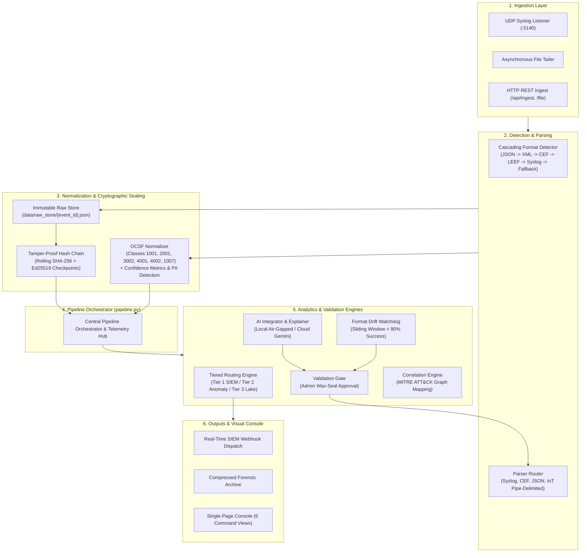

# LogSetu — System Architecture Document
**Universal Log Pre-processing & Cryptographic Forensic Framework (SIH26156)**  
*Nodal Agency: National Technical Research Organisation (NTRO) | Theme: Blockchain & Cybersecurity*

---

## 1. System Overview & Core Design Goals

LogSetu is an on-premises, air-gapped **Security Data Pipeline Platform (SDPP)** engineered to solve high-velocity log fragmentation, unverified audit trails, and escalating SIEM licensing costs within sovereign defense networks. 

The architecture is built around four foundational engineering tenets:
1. **Universal Zero-Configuration Ingestion:** Cascading format detection (JSON $\to$ XML $\to$ CEF $\to$ LEEF $\to$ Syslog $\to$ Fallback) capable of ingesting arbitrary log formats at line rate without prior schema knowledge.
2. **Deterministic OCSF Normalization:** Strict transformation of heterogeneous telemetry into the Open Cybersecurity Schema Framework (OCSF) with per-field confidence scoring and automated PII detection.
3. **Cryptographic Evidentiary Non-Repudiation:** A tamper-evident rolling SHA-256 hash chain with periodic Ed25519 asymmetric digital signatures for court-admissible forensic validity.
4. **Intelligent Tiered Cost Reduction:** Classification into real-time SIEM alerts (Tier 1), sampled anomaly telemetry (Tier 2), and compressed cold storage (Tier 3), reducing billable SIEM volume by **40% to 70%**.

---

## 2. End-to-End Pipeline Flow

---

## 3. Subsystem Specifications

### 3.1 Ingestion & Cascading Format Detection
- **Collectors:** Asynchronous non-blocking UDP socket listener running on unprivileged port `5140`, background asynchronous file tailers, and multi-part HTTP REST endpoints (`/api/ingest`, `/api/ingest/file`).
- **Cascading Detection (`detector.py`):** Inspects payloads in sub-millisecond priority:
  `JSON` $\to$ `XML` $\to$ `CEF` (`^CEF:\d+\|`) $\to$ `LEEF` (`^LEEF:\d+\.\d+\|`) $\to$ `Syslog RFC 5424 / 3164` $\to$ `Fallback (Pipe & Key-Value)`.
- **Parsing Router (`router.py`):** Unescapes CEF delimiters, flattens recursive JSON structures, decodes Syslog PRI facilities, and extracts unknown key-value pairs.

### 3.2 OCSF Normalization & Privacy Protection (`ocsf.py`)
- **OCSF Event Classes:** Maps entities to standard OCSF taxonomies: 1001 (Authentication), 2001 (Security Finding), 3002 (Access Control), 4001 (Network Activity), 4002 (HTTP Activity), and 1007 (Process Activity).
- **Confidence Scoring:** Assigns mathematical certainty per field: `1.0` (Direct standard extraction), `0.999` (Deterministic mapping rule), `0.85` (Inferred heuristic fallback).
- **PII Guard:** Scans and flags sensitive data (Email, SSN, Credit Cards, Phone Numbers, RFC 1918 Private IPs) and tags regulatory sensitivity (`Restricted`, `Secret`, `Unclassified`).

### 3.3 Cryptographic Hash Chain & Non-Repudiation (`hashchain/engine.py`)
- **Content-Addressed Storage:** Every raw log string is persisted to disk at `data/raw_store/{event_id}.json` indexed by its SHA-256 content hash.
- **Rolling Blockchain Ledger:** Blocks are cryptographically chained:
  $$\text{block\_hash}_n = \text{SHA256}(\text{block\_hash}_{n-1} \parallel \text{content\_hash}_n)$$
- **Asymmetric Ed25519 Signatures:** Periodic checkpoints (`CHECKPOINT_INTERVAL = 10`) are digitally signed using an Ed25519 private key. The public key is exposed for independent forensic verification.
- **Tamper Detection & Auto-Heal:** Deliberate byte corruption of raw disk logs or block hashes is instantly identified with the exact block ID; integrity can be restored atomically from immutable backup.

### 3.4 Tiered Cost-Aware Routing (`routing/engine.py`)
- **Tier 1 (Real-Time Forwarding):** High and Critical events, security findings, and brute-force bursts are forwarded directly to SIEM webhooks.
- **Tier 2 (Anomaly Stream):** Moderate behavioral telemetry streams into an Isolation Forest model.
- **Tier 3 (Cold Archive):** High-volume, low-signal noise (routine firewall pings, debug traces) is deflected to compressed storage.
- **Volume Reduction:** Empirically verified at **61.6% volume reduction** on benchmark feeds.

### 3.5 Format Drift Watchdog & AI Validation Gate (`ai_integrator/` & `drift_detector/`)
- **Drift Monitoring:** Tracks parse success over rolling 100-event windows. Success dropping below 90% triggers automated alerts and schema re-mapping proposals.
- **AI Integrator:** Synthesizes regex extractors and OCSF mappings using Gemini/Groq (Cloud) or `LocalFallbackAI` (100% Air-Gapped On-Premises).
- **Validation Gate:** Proposed mappings remain `PENDING` until an operator with the **Admin** role validates accuracy against held-out sample logs and digitally applies the "Wax Seal" into production.

---

## 4. Deployment Topology & Sovereign Security

LogSetu runs standalone on bare-metal or sovereign virtualized environments via Docker Compose:
- **Zero Cloud Dependence:** In Local Mode, all parsing, hashing, normalisation, and AI proposals operate locally without network egress.
- **Thread Safety:** Core engines utilize native mutex locks (`threading.Lock()`), ensuring crash-proof ingestion under heavy concurrent loads.
- **Zero-Build Presentation Console:** Vanilla HTML5/CSS3/ES6+ frontend connects dynamically to FastAPI on port 8000 with real-time status monitoring.
